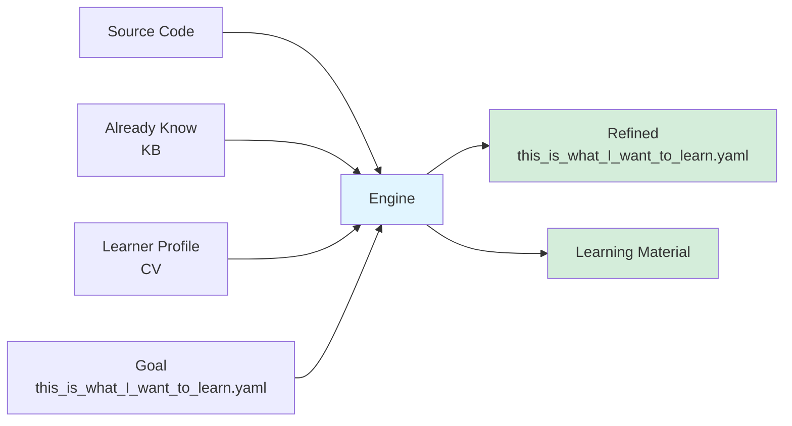

## 方法论

### 高效的学习

学：在学习者脑海中构建一个符合认知的伪代码库。里面包括了 class （概念），function （处理）以及它们之间的关系网

习：总结面对不同的问题，采用哪些组合去解决。把这些组合提炼成套路。

程序语言是最好的学习材料，里面包括了经过验证的前人对于一个领域的精确描述，而且自带context，完全没有歧义。

问题：但是程序语言本身有很多不太对人脑友好的地方。
1 commensense依赖
程序描述是建立在编程语言基础之上的，这是一个先期投入的门槛。

2 非线形组织结构
人类的阅读是线性的，源代码是非线形的，单纯的深度优先或者广度优先都不一定适合，要把代码序列化变成一个线性的阅读订单。

3 隐形的先验知识
每个学习者脑海中已经掌握的知识和技能不一样，必须参考这一点来做个性化生产学习内容。

4 材料的取舍和颗粒度
代码库庞杂，需要做取舍和颗粒度调整，把学习时间变得可控。也就是我们构建的伪代码的信息量需要可控。
采用80/20原则，采用明确学习目标来辅助 筛选材料。

我希望在这里做一套可以翻译成人脑友好的学习材料的方法和工具。

### 认知负担

在提升人脑的认知能力 和 降低材料的认知负担 中，坚定的选择后者，因为前者的投入产出比很低，且难以量化，这条路走不通。

### 心智模型

学习点序列化，线性材料，每个材料里尽量少包含新的东西，如果有，要么合并，要么前置。

尽量使用脑海中已经拥有的概念和简单的语言去描述一个东西，包含trigger，就是什么时候需要加载这个模型到工作记忆。

### 习，训练

采用Deep practice 刻意练习的方法论

## work log

### 0.1 版本，基于本地curso版本

首先把被学习的代码库放在 context 里
已经学习的内容整理成知识图谱/知识库
输入一篇学习材料，也可以是一个query 一句话。

用prompt curso的方法，要求curso 先生成一个路线图，然后输出一组 顺序阅读的学习材料，每一个材料只表述一个学习点。

## 后续可能去实现的需求

基于Dify的产品 (可以分享)
知识库与笔记软件集成
