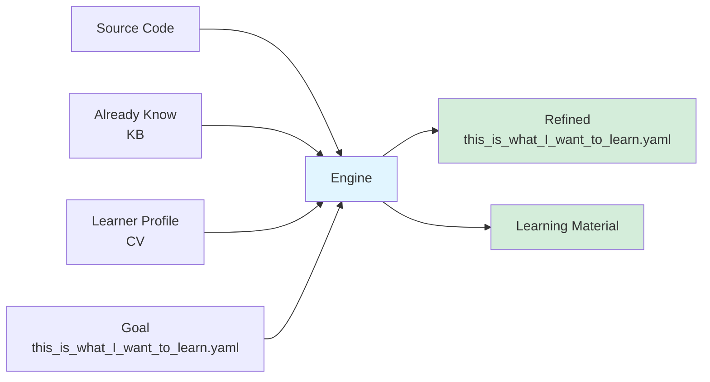

# Adaptive Knowledge-Grounded Learning (AKGL)

目标：不是让学习者适配学习材料，而是让学习材料去适配学习者。

## 特点

1. 面向源代码学习，而不是面向文档学习。文档的理解千差万别，源代码只有一套固定的描述。我们选择确定性。
2. 低认知负担：学习者的已有知识是生成学习材料的必要输入，学习材料不应该使用学习者尚未具备的术语和概念。
3. 线性学习，复杂的知识点必须被“序列化”为一组前面不依赖后面的知识点。
4. 学习过程的结果是更新的知识库和输出产品。
5. 单一目标，深度练习
6. 面向输出学习。
7. 及时chunk，把相似概念以及固定搭配的东西及时组合成为更高层的概念。

## 困难

1. 源代码库是非线性的结构，怎样拆解成为线性的学习点。（一次不行，需要动态调整，材料的输出需要有review，再次生成的迭代）
2. 源代码库及其庞杂，怎么取舍？ （学习者必须在开始阶段就输入一个最后的工程实践输出，根据这个工程需求进行取舍）
3. 不管怎么精细设计，学习者还是会有ad hoc的问题，这些问题需要得到解决，并且体现在学习材料上
4. 怎么每个知识点都做及时练习。

## 工作原理

1. 学习者用简历和知识库的形式提供自身已经掌握的技能和术语。（起点）
2. 学习者提供学习目标的源代码库（例如，apache Flink）
3. 学习者输入原始版本的学习目标，可以是大颗粒度，例如 在生产环境里使用Flink做一个实时Web3 biance交易所交易数据的抓取 ETL项目。（终点）也可以是小颗粒度，例如上一次AI生成的学习点。
4. 学习者提供一组问题，帮助AI意识到思维盲区
5. AI分析起点和终点，给出更新了的细化的知识技能点。
6. AI review，调整顺序，保证前后顺序可以满足前面的点对后续的点没有依赖。
7. 逐点生成学习材料 （有非常详细的要求）
定义和类比，伪代码，原始代码链接，最小可用实例，常见错误，思维trigger
使用generate - review - patcher 模式迭代生成

8. AI review，寻找错误和过时的表述。
9. 学习中持续输出问题和笔记到知识库和问题库。
10. 随时可以生成新版本的学习材料。
11. 有进度记录

## work log

### 0.1 版本，基于本地curso版本

首先把被学习的代码库放在 context 里
已经学习的内容整理成知识图谱/知识库
输入一篇学习材料，也可以是一个query 一句话。

用prompt curso的方法，要求curso 先生成一个路线图，然后输出一组 顺序阅读的学习材料，每一个材料只表述一个学习点。

## 后续可能去实现的需求

基于Dify的产品 (可以分享)
知识库与笔记软件集成
